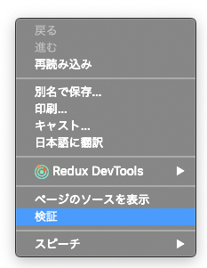
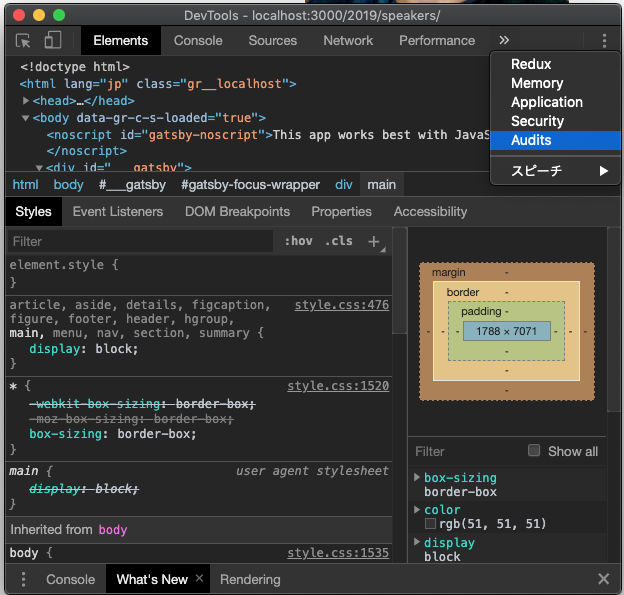
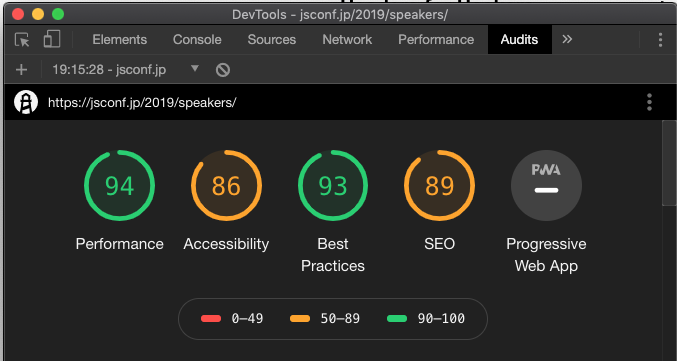

## About

- TODO

## 開発を始める

### 必要なもの

- Github のアカウント
- git
- node
- Chrome

### まずはサーバーを起動してみよう

- 以下のコマンドを実行

```
$ git clone https://github.com/recruit-tech/speed-hackathon-jsconf.jp.git
$ cd speed-hackathon-jsconf.jp
$ npm i
$ npm start
```

`npm start` すると サーバーを起動されます．
サーバーが起動されたら，chrome で http://localhost:3000/2019/speakers にアクセスしよう

#### :sparkles: Tips

`npm start` すると，対応している場合ブラウザが自動で開きます

### Lighthouse で スコアを計測してみよう

#### 1. Chrome の 開発者ツールを立ち上げる



#### 2. タブから Audits を選択



#### 3. lighthouce を実行

- 1. Device から `Desktop` を選択
- 1. 青いボタンの `Run audits` をクリックする


#### 4. 100点 を目指そう！



